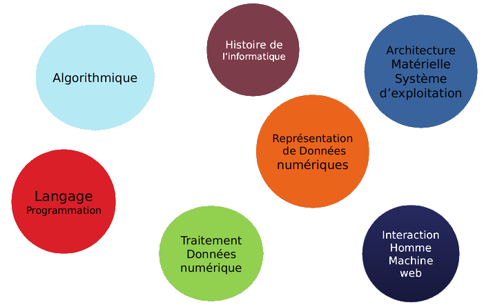
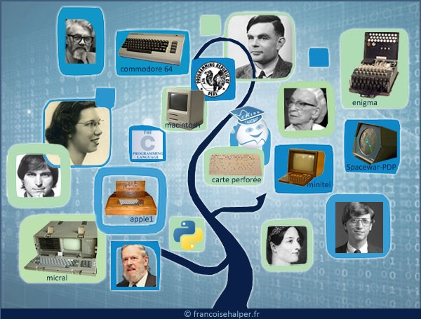
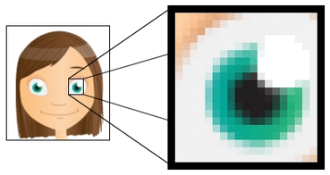
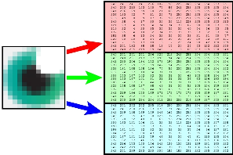
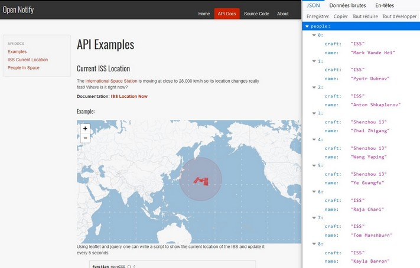
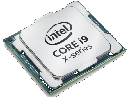
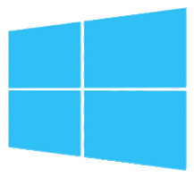
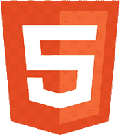
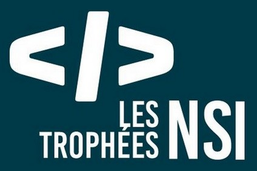

% Spécialité NSI
% 
% _Numérique & Sciences Informatiques_

## NSI ?

### Pourquoi choisir NSI ?

Le numérique est présent dans tous les secteurs d’activités et même dans notre quotidien.

Le choix de la spé NSI est donc pertinent :

:::incremental
* évidemment, pour celles et ceux qui envisagent une carrière dans l’informatique.
* mais aussi, pour celles et ceux qui souhaitent acquérir une compétence forte en informatique sans en faire le centre de leur projet professionnel.
:::

### Les programmes

Les programmes de [_Première_](PDF/programme1ere.pdf) et de [_Terminale_](PDF/programmeTerm.pdf) NSI sont articulés autour de 7 thèmes \(source: [_Eduscol_](https://eduscol.education.fr/2068/programmes-et-ressources-en-numerique-et-sciences-informatiques-voie-g)\)

### Histoire de l'informatique:

### Représentation des données numériques:

  
 

### Traitement des données numériques:	

### Interaction entre l'homme et la machine sur le Web:
	

	
### Architecture matérielle & système d'exploitation:

  

 
		
### Langages de programmation:

  

    
	
### Algorithmique:
	
Décrire & organiser des règles opératoires permettant de répondre à une problématique.

## Projets & Concours

###  Activités pratiques & mini projets : 

### Projets 2022 : 

 

### Concours: 

 &emsp;&emsp;&emsp;&emsp; 

## Construire son Projet Professionnel autour de la NSI

### Etudes  postbac 

:::incremental
* Classes préparatoires (CPGE) dont la nouvelle MP2I
* Ecoles d’ingénieurs à dominante informatique (ENSI, ISEN, INSA, ESIR, SUP Info, etc.) 
* Licences universitaires en sciences et technologies (en particulier les licences "info" & "maths/info")
* BUT (Informatique, R&T, STID, GEII)
* BTS ("Systèmes Numériques", "Services Informatiques aux Organisations")
:::

### Débouchés professionnels

Une formation en informatique sera un atout pour trouver un emploi dans un monde professionnel en pleine révolution digitale.

 [_enquête "Talents du Numérique"_](PDF/enquete-formation-emploi-2020-infographie-direct-du-16-02-21-2535.pdf)

